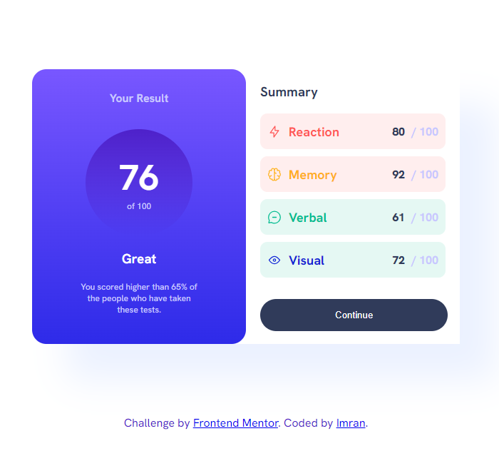
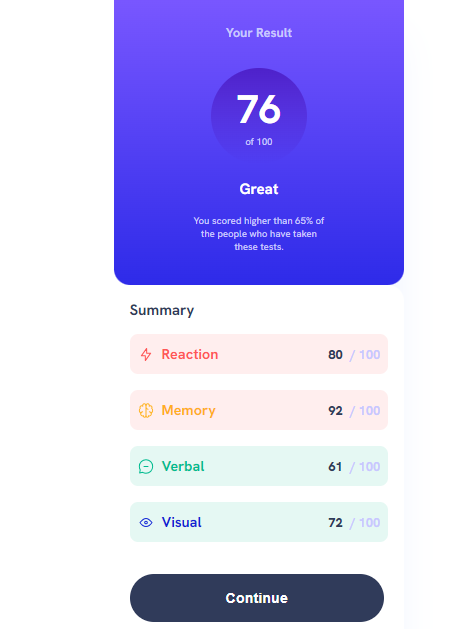

# Frontend Mentor - Results summary component solution

This is a solution to the [Results summary component challenge on Frontend Mentor](https://www.frontendmentor.io/challenges/results-summary-component-CE_K6s0maV). Frontend Mentor challenges help you improve your coding skills by building realistic projects. 

## Table of contents

- [Overview](#overview)
  - [The challenge](#the-challenge)
  - [Screenshot](#screenshot)
  - [Links](#links)
  - [Built with](#built-with)
  - [What I learned](#what-i-learned)
- [Author](#author)

## Overview

### The challenge

Users should be able to:

- View the optimal layout for the interface depending on their device's screen size
- See hover and focus states for all interactive elements on the page
- **Bonus**: Use the local JSON data to dynamically populate the content

### Screenshot

### Links

- Solution URL: [solution URL here](https://github.com/m-im-ha)
- Live Site URL: [live site URL here](https://your-live-site-url.com)

### Built with

- CSS custom properties
- Flexbox
- CSS Grid

### What I learned

I have learned html and css. 

## Author

- Frontend Mentor - [@m-im-ha](https://www.frontendmentor.io/profile/m-im-ha)

